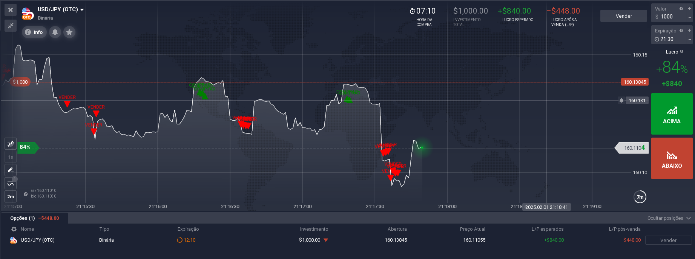
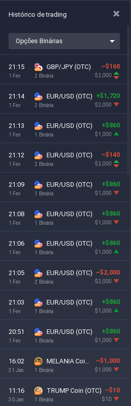

# 📈 script astrahvh - Indicador para Opções Binárias

O **script astrahvh** é um **indicador técnico avançado** desenvolvido para **opções binárias**, fornecendo **sinais de compra e venda** com alta precisão. Ele combina **Bandas de Bollinger, RSI, CCI, MACD, ADX** e outras métricas para identificar **o melhor momento para entrar em operações**.

---

## 🔥 **Como Funciona?**
O script analisa o mercado e gera **sinais visuais** para compra e venda com base em múltiplos indicadores técnicos. Ele funciona da seguinte forma:

✅ **Sinal de COMPRA** (🔼): Aparece quando o preço está em uma região estratégica para valorização.  
✅ **Sinal de VENDA** (🔽): Aparece quando o preço tem probabilidade de queda.  

Os sinais são gerados **automaticamente** e exibidos diretamente no gráfico, facilitando a tomada de decisões.

---

## 📌 **Recursos do Indicador**
🔹 Bandas de Bollinger para detectar volatilidade.  
🔹 RSI (Índice de Força Relativa) para confirmar sobrecompra e sobrevenda.  
🔹 CCI (Commodity Channel Index) para capturar reversões.  
🔹 MACD (Média Móvel Convergência/Divergência) para filtrar tendências.  
🔹 ADX (Índice Direcional Médio) para medir a força da tendência.  
🔹 **Filtros adicionais** como VWAP, Parabolic SAR, ATR e SuperTrend.  

---

## 📷 **Exemplo de Uso**
Aqui estão algumas capturas de tela do indicador em ação:

### 📊 **Sinais de compra e venda no gráfico**

### 📊 **Histórico de operações**

---

## 🚀 **Melhores Configurações**
🔹 **Melhores timeframes:** 1M, 5M, 15M (Scalping) / 30M, 1H (Day Trade).  
🔹 **Melhores ativos:** EUR/USD, GBP/USD, USD/JPY (Forex) / BTC/USDT, ETH/USDT (Cripto).  

Este script é ideal para **traders que buscam sinais precisos e automatizados** para melhorar a assertividade nas operações.

---

## ⚡ **Como Usar?**
1. **Copie o código do script** e adicione à sua plataforma de trading.  
2. **Configure os indicadores** conforme sua estratégia.  
3. **Acompanhe os sinais** no gráfico e entre nas operações.  

Boa sorte e bons trades! 🚀📈
